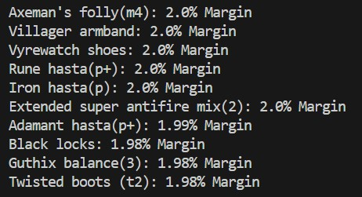

# Flip Finder for OSRS - Python Application
This application uses the OSRS Wiki API to calculate the current margins on Old School RuneScape items. The Flip Finder prints the top 10 margins currently on the Grand Exchange.

